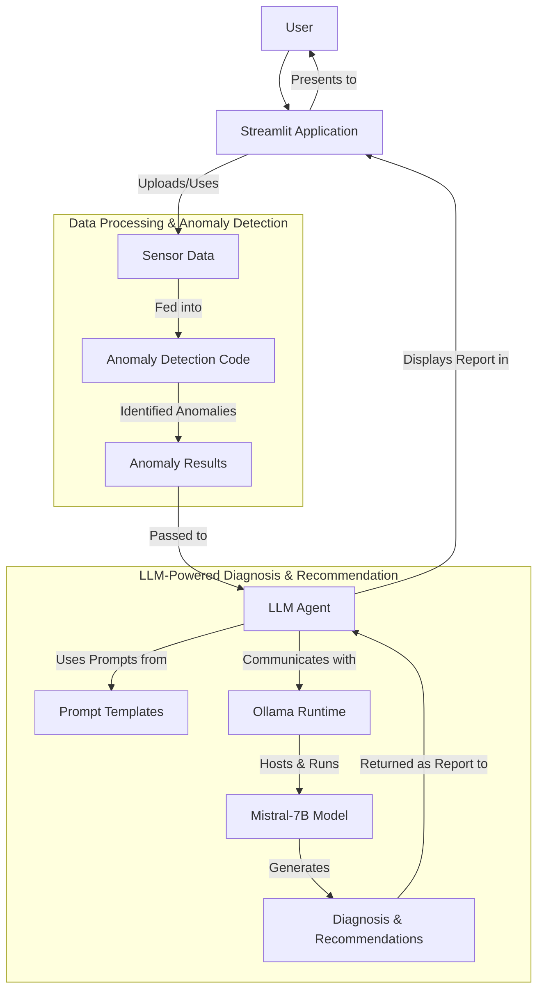

# LLM Diagnosis Recommender

## Project Overview

This project demonstrates an **LLM-powered system for diagnosing anomalies in sensor data and recommending solutions**. It's designed to help technicians quickly understand complex issues and get actionable steps for resolution, directly from their data.

Key functionalities include:
-   **Data Analysis**: Loading and processing sensor time-series data.
-   **Automated Anomaly Detection**: Identifying unusual patterns using machine learning.
-   **AI-Powered Diagnosis**: Using a local Large Language Model (LLM) to interpret anomalies, suggest causes, and recommend fixes.
-   **Interactive Application**: A user-friendly interface to visualize data, run diagnostics, and get reports.

## System Architecture

Here's a high-level overview of how the different components of this system interact:



## Setup Instructions

Follow these steps to get the project running locally.

### 1. Clone the Repository

If you haven't already, clone this project to your local machine:

```bash
git clone <repository-url>
cd llm_diagnosis_recommender
```

### 2. Install Ollama and Download the Mistral Model

This project uses [Ollama](https://ollama.com/) to run large language models locally on your computer.

1.  **Download and Install Ollama**: Visit [ollama.com/download](https://ollama.com/download) and follow the instructions to install Ollama for your operating system. Make sure Ollama is running in the background (it often starts as a service).
2.  **Download the Mistral Model**: Open your terminal (Command Prompt or PowerShell) and pull the Mistral model. This model will be used by the LLM Agent for diagnosis.
    ```bash
    ollama pull mistral
    ```
    *(Optional: You can verify it works by running `ollama run mistral` and typing a message.)*

### 3. Python Environment Setup

It's highly recommended to use a [Python virtual environment](https://docs.python.org/3/library/venv.html) to manage project dependencies.

1.  **Navigate to the project root**: Ensure your terminal is in the `llm_diagnosis_recommender` directory.
2.  **Install Python dependencies**: Execute the following command to install all necessary Python packages listed in `requirements.txt`:
    ```bash
    pip install -r requirements.txt
    ```
    *If `pip` is not recognized, ensure Python is correctly installed and added to your system's PATH. Restart your terminal after updating PATH variables.*

### 4. Environment Variables (Optional)

For local LLMs like Ollama, an API key (`OPENAI_API_KEY`) is no longer required. However, if you need to store other credentials or configurations (e.g., for different local LLM API endpoints or future integrations), you can create a `.env` file.

If you plan to use environment variables, create a file named `.env` in the root of the `llm_diagnosis_recommender` directory and add your variables there. For example:

```
# Example for other API keys or configurations
HUGGINGFACE_TOKEN="your_huggingface_token_here" # Only if using HuggingFace models that require it
```

## How to Run the Application

### Running the Streamlit Application (Main Interface)

This is the primary user interface for interacting with the system.

1.  **Ensure Ollama is running**: Make sure the Ollama application/service is active in your background.
2.  **Navigate to the project root**: Open your terminal and `cd` into the `llm_diagnosis_recommender` directory.
3.  **Start the Streamlit app**:
    ```bash
    streamlit run app/app.py
    ```
4.  The application will automatically open in your default web browser, typically at `http://localhost:8501`.

### Running the Jupyter Notebook (For Analysis)

The `notebooks/anomaly_detection.ipynb` can be used for deeper data exploration and model insights.

1.  **Install Jupyter** (if you haven't already):
    ```bash
    pip install jupyter
    ```
2.  **Navigate to the project root** in your terminal.
3.  **Start Jupyter Notebook**:
    ```bash
    jupyter notebook
    ```
4.  In the Jupyter interface that opens in your browser, navigate to the `notebooks/` directory and click on `anomaly_detection.ipynb` to open it.

## Expected Output & Troubleshooting

*(Here, you would typically add screenshots of your Streamlit app in action, showing the data upload, anomaly plots, and a sample LLM-generated report.)*

**Expected Streamlit App Flow:**
1.  **Upload Data**: Upload `data/sample_sensor_data.csv` (or your own compatible CSV).
2.  **Visualize & Detect**: The app will display sensor trends. Select columns and click "Run Anomaly Detection" to see detected anomalies highlighted.
3.  **Diagnose & Recommend**: Provide any additional context in the text area and click "Get LLM Diagnosis & Recommendations". The LLM will process the anomaly data and context, returning a comprehensive report.

**Common Troubleshooting:**
*   **`pip` / `python` not recognized**: Ensure Python and `pip` are correctly added to your system's PATH environment variables. Restart your terminal after making changes.
*   **`ModuleNotFoundError`**: Run `pip install -r requirements.txt` to ensure all Python libraries are installed.
*   **`Ollama call failed with status code 404`**: Ensure Ollama is installed, running, and you have downloaded the `mistral` model using `ollama pull mistral`.
*   **Slow LLM response**: Consider downloading a more quantized Mistral model (e.g., `mistral:7b-instruct-v0.2-q4_K_M`) and ensure Ollama is utilizing your GPU if available. Refer to Ollama documentation for GPU setup.

