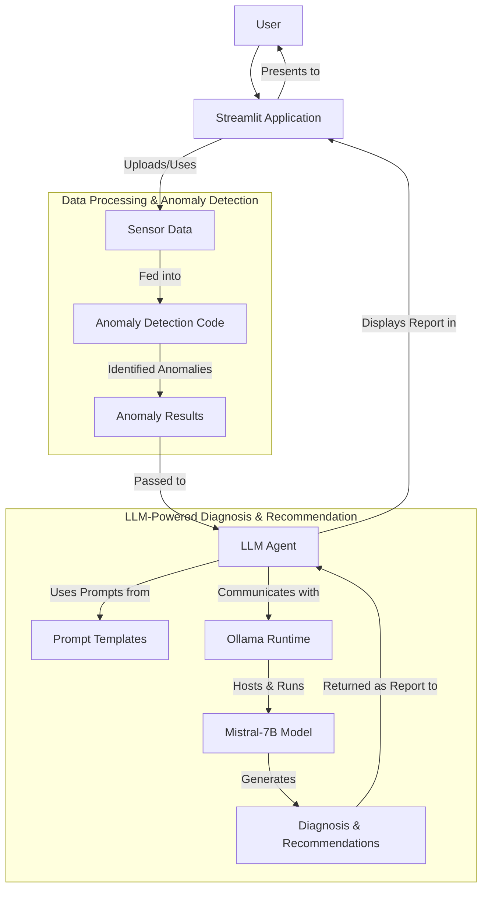

# LLM Diagnosis Recommender

## Project Documentation

For detailed information about the project, please refer to our [Full Documentation](docs/project_documentation.md).

## Project Overview

This project demonstrates an **LLM-powered system for diagnosing anomalies in sensor data and recommending solutions**. It's designed to help technicians quickly understand complex issues and get actionable steps for resolution, directly from their data.

Key functionalities include:
-   **Data Analysis**: Loading and processing sensor time-series data.
-   **Automated Anomaly Detection**: Identifying unusual patterns using machine learning.
-   **AI-Powered Diagnosis**: Using a local Large Language Model (LLM) to interpret anomalies, suggest causes, and recommend fixes.
-   **Interactive Application**: A user-friendly interface to visualize data, run diagnostics, and get reports.

## System Architecture

Here's a high-level overview of how the different components of this system interact:



## Setup Instructions

Follow these steps to get the project running locally.

### 1. Clone the Repository

If you haven't already, clone this project to your local machine:

```bash
git clone <repository-url>
cd llm_diagnosis_recommender
```

### 2. Install Ollama and Download the Mistral Model

This project uses [Ollama](https://ollama.com/) to run large language models locally on your computer.

1.  **Download and Install Ollama**: Visit [ollama.com/download](https://ollama.com/download) and follow the instructions to install Ollama for your operating system. Make sure Ollama is running in the background (it often starts as a service).
2.  **Download the Mistral Model**: Open your terminal (Command Prompt or PowerShell) and pull the Mistral model. This model will be used by the LLM Agent for diagnosis.
    ```bash
    ollama pull mistral
    ```
    *(Optional: You can verify it works by running `ollama run mistral` and typing a message.)*

### 3. Python Environment Setup

It's highly recommended to use a [Python virtual environment](https://docs.python.org/3/library/venv.html) to manage project dependencies.

1.  **Navigate to the project root**: Ensure your terminal is in the `llm_diagnosis_recommender` directory.
2.  **Install Python dependencies**: Execute the following command to install all necessary Python packages listed in `requirements.txt`:
    ```bash
    pip install -r requirements.txt
    ```
    *If `pip` is not recognized, ensure Python is correctly installed and added to your system's PATH. Restart your terminal after updating PATH variables.*

### 4. Environment Variables (Optional)

For local LLMs like Ollama, an API key (`OPENAI_API_KEY`) is no longer required. However, if you need to store other credentials or configurations (e.g., for different local LLM API endpoints or future integrations), you can create a `.env` file.

If you plan to use environment variables, create a file named `.env` in the root of the `llm_diagnosis_recommender` directory and add your variables there. For example:

```
# Example for other API keys or configurations
HUGGINGFACE_TOKEN="your_huggingface_token_here" # Only if using HuggingFace models that require it
```

## How to Run the Application

### Running the Streamlit Application (Main Interface)

This is the primary user interface for interacting with the system.

1.  **Ensure Ollama is running**: Make sure the Ollama application/service is active in your background.
2.  **Navigate to the project root**: Open your terminal and `cd` into the `llm_diagnosis_recommender` directory.
3.  **Start the Streamlit app**:
    ```bash
    streamlit run app/app.py
    ```
4.  The application will automatically open in your default web browser, typically at `http://localhost:8501`.

### Running the Jupyter Notebook (For Analysis)

The `notebooks/anomaly_detection.ipynb` can be used for deeper data exploration and model insights.

1.  **Install Jupyter** (if you haven't already):
    ```bash
    pip install jupyter
    ```
2.  **Navigate to the project root** in your terminal.
3.  **Start Jupyter Notebook**:
    ```bash
    jupyter notebook
    ```
4.  In the Jupyter interface that opens in your browser, navigate to the `notebooks/` directory and click on `anomaly_detection.ipynb` to open it.

## Expected Output & Troubleshooting

*(Here, you would typically add screenshots of your Streamlit app in action, showing the data upload, anomaly plots, and a sample LLM-generated report.)*

**Expected Streamlit App Flow:**
1.  **Upload Data**: Upload `data/sample_sensor_data.csv` (or your own compatible CSV).
2.  **Visualize & Detect**: The app will display sensor trends. Select columns and click "Run Anomaly Detection" to see detected anomalies highlighted.
3.  **Diagnose & Recommend**: Provide any additional context in the text area and click "Get LLM Diagnosis & Recommendations". The LLM will process the anomaly data and context, returning a comprehensive report.

**Common Troubleshooting:**
*   **`pip` / `python` not recognized**: Ensure Python and `pip` are correctly added to your system's PATH environment variables. Restart your terminal after making changes.
*   **`ModuleNotFoundError`**: Run `pip install -r requirements.txt` to ensure all Python libraries are installed.
*   **`Ollama call failed with status code 404`**: Ensure Ollama is installed, running, and you have downloaded the `mistral` model using `ollama pull mistral`.
*   **Slow LLM response**: Consider downloading a more quantized Mistral model (e.g., `mistral:7b-instruct-v0.2-q4_K_M`) and ensure Ollama is utilizing your GPU if available. Refer to Ollama documentation for GPU setup.

The error message `cudaMalloc failed: out of memory` is very specific and crucial: it means that your **GPU (Graphics Processing Unit) ran out of dedicated memory (VRAM)** when Ollama tried to load and run the `phi` model.

Even though `phi` is a smaller model, LLMs still require significant VRAM, especially during inference.

Here's how you can address this to reduce memory usage and hopefully get the LLM report generation working:

### 1. Use a More Quantized Model (Most Effective)

The best way to reduce VRAM usage is to use a model that has been "quantized" more aggressively. Quantization reduces the precision of the model's weights, making it smaller and faster, with a slight trade-off in accuracy (often imperceptible for many tasks).

*   **Try a highly quantized `phi` model:** While `ollama pull phi` usually pulls a default quantization, you can explicitly ask for a smaller one if available. You'd need to check Ollama's model library or tags for specific `phi` quantizations.
    *   If you're still using `mistral`, you can definitely get more quantized versions:
        ```bash
        ollama pull mistral:7b-instruct-v0.2-q4_K_M
        # or even smaller, if available and acceptable quality:
        ollama pull mistral:7b-instruct-v0.2-q2_K
        ```
    *   You can explore available quantizations on the [Ollama models page](https://ollama.com/models) or by running `ollama run MODEL_NAME:?` (e.g., `ollama run mistral:?`) to see tags.
*   **Update `llm/langchain_agent.py`**: If you download a specific quantized model, remember to update the `model_name` in your `llm/langchain_agent.py` file accordingly:
    ```python
    # In llm/langchain_agent.py
    class LLMAgent:
        def __init__(self, model_name: str = "mistral:7b-instruct-v0.2-q4_K_M", base_url: str = "http://localhost:11434"):
            self.llm = Ollama(model=model_name, base_url=base_url)
    ```

### 2. Reduce LLM Output Length (Less VRAM during generation)

Shorter responses from the LLM require less memory during the generation process.

*   **Limit `num_predict` in `llm/langchain_agent.py`**:
    ```python
    # In llm/langchain_agent.py within the __init__ method for self.llm
    self.llm = Ollama(model=model_name, base_url=base_url, num_predict=128) # Adjust 128 as needed
    ```
    This sets a maximum token limit for the LLM's output.

### 3. Free up GPU Memory

*   **Close other GPU-intensive applications:** Games, video editors, other AI/ML applications, or even too many browser tabs using hardware acceleration can consume VRAM. Close them before running the Streamlit app.
*   **Restart your computer:** Sometimes VRAM isn't fully released by applications even after they're closed. A restart can clear it.

### 4. Force Ollama to Run on CPU (If VRAM is consistently an issue)

If your GPU simply doesn't have enough VRAM for any model, you can force Ollama to run on your CPU. This will be **significantly slower** but might be your only option if VRAM is very limited.

*   **Set `OLLAMA_ORIGINS` environment variable (temporary in terminal):**
    ```bash
    # For Windows Command Prompt:
    set OLLAMA_ORIGINS=cpu
    # Then run your Streamlit app from the same terminal:
    streamlit run app/app.py
    ```
    *   **Note:** This is a temporary setting for the current terminal session. To make it permanent, you'd set it as a system-wide environment variable.

**Recommendation:**

Start by pulling a more quantized version of the model you intend to use (e.g., `mistral:7b-instruct-v0.2-q4_K_M` if you're using Mistral, or look for quantized `phi` versions), and update `llm/langchain_agent.py`. Then, ensure no other heavy applications are using your GPU.